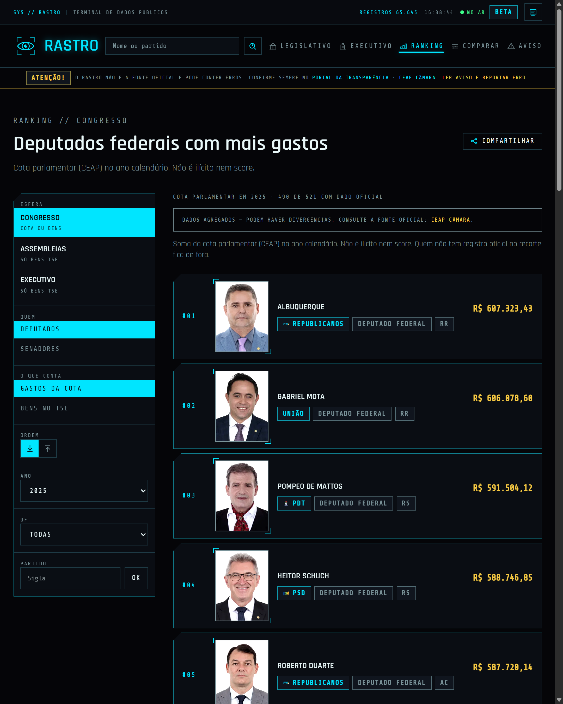
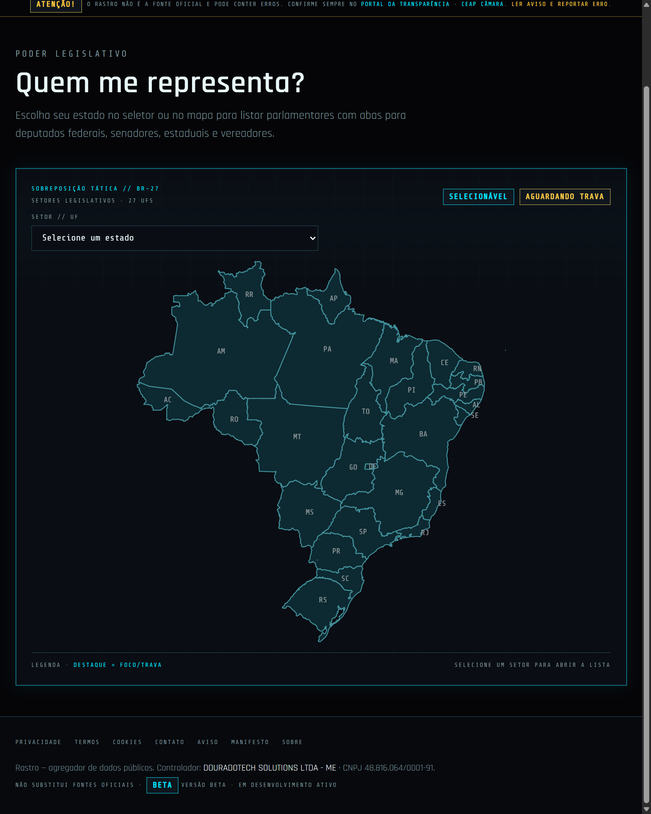
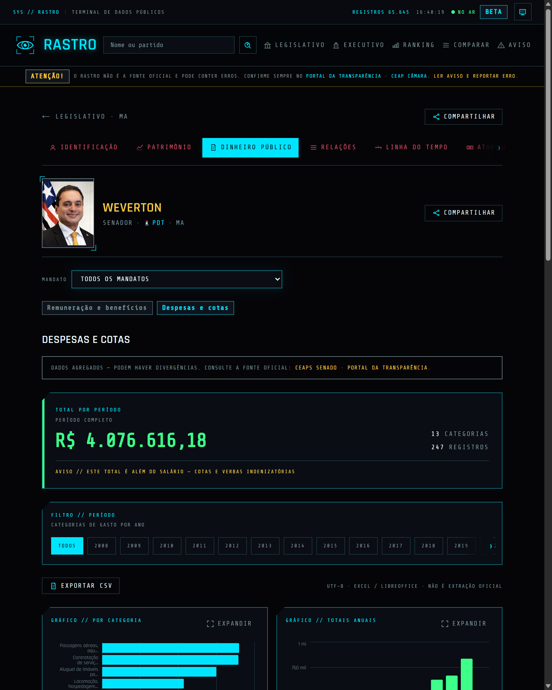
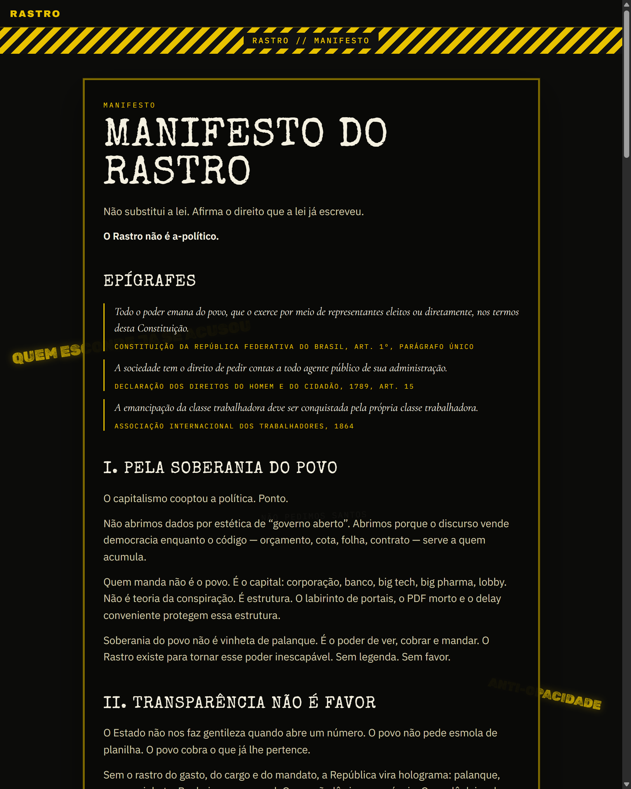
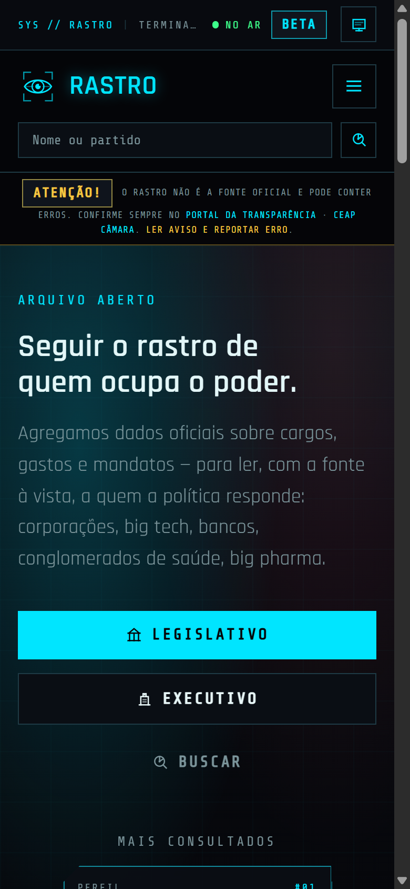

# Rastro

**Terminal de dados públicos** sobre quem ocupa o poder no Brasil.

Agrega cargos, gastos documentados e mandatos a partir de fontes **oficiais** — Câmara, Senado, TSE — com a fonte à vista. Não inventa número. Não é score de ninguém.

<p align="center">
  <a href="https://rastro.report"><strong>rastro.report</strong></a>
  &nbsp;·&nbsp; beta
</p>

> O Rastro **não é a fonte oficial** e pode conter erros ou atraso. Confirme sempre no portal do órgão.

<p align="center">
  <a href="https://rastro.report">
    
  </a>
</p>

## O que é

Os dados públicos do Brasil não faltam. Falta um lugar que não faça abrir seis portais para achar o mesmo nome.

O Rastro junta o que o Estado já publicou — identidade, mandato, cota parlamentar, carreira eleitoral — e devolve isso numa consulta tipo **dossiê / terminal**. O recorte é político e está escrito no [manifesto](https://rastro.report/manifesto): quem ocupa o poder responde a alguém.

<table width="100%">
  <thead>
    <tr>
      <th width="50%" align="left">É</th>
      <th width="50%" align="left">Não é</th>
    </tr>
  </thead>
  <tbody>
    <tr>
      <td>Agregador em <strong>beta</strong></td>
      <td>Fonte da verdade — a fonte continua no órgão</td>
    </tr>
    <tr>
      <td>Consulta / dossiê público</td>
      <td>Score de corrupção ou denúncia</td>
    </tr>
    <tr>
      <td>Transparência com recorte explícito</td>
      <td>Portal institucional “neutro”</td>
    </tr>
    <tr>
      <td>Produto próprio em <a href="https://rastro.report">rastro.report</a></td>
      <td>App de governo</td>
    </tr>
  </tbody>
</table>

<br />

<table width="100%">
  <tr>
    <td width="48%" valign="top">
      
    </td>
    <td width="4%"></td>
    <td width="48%" valign="top">
      
    </td>
  </tr>
</table>

<br />

<table width="100%">
  <tr>
    <td width="48%" valign="top">
      
    </td>
    <td width="4%"></td>
    <td width="48%" valign="top">
      
    </td>
  </tr>
</table>

<p align="center">
  
</p>

## O que já dá para consultar

- **Legislativo federal** — deputados e senadores por UF, CEAP/CEAPS, ficha com gráficos
- **Executivo** — governadores e prefeitos (TSE)
- **Busca**, **ranking** de gasto documentado, **comparar** federais
- **Ficha em capítulos** — identificação, patrimônio, dinheiro público, relações, linha do tempo, atuação, eleitoral
- **Manifesto**, aviso e páginas de privacidade no ar.

Números na home são cobertura sincronizada (cota / teto legal do Congresso), não o gasto total da República.

## O que ainda não entra

Escrito no próprio site, não escondido no rodapé:

- Folha / remuneração do executivo nas fichas
- Despesas e votações de assembleia (identidade TSE dos estaduais já lista)
- Contracheque individual do Congresso
- Ministérios / folha federal além da presidência TSE

Empty states honestos no lugar de número inventado.

## Como o dado flui

```text
Fontes oficiais
 Câmara · Senado · TSE
        ↓
  Jobs CLI de sync
        ↓
    PostgreSQL
        ↓
   API Fastify
        ↓
     Next.js
```

A página **não** consulta o órgão a cada request. Ingestão sobe o dado; a API de leitura só fala com o banco. Cada registro carrega proveniência (`source` / link oficial quando existe).

## Stack

| Camada | Tecnologia |
| --- | --- |
| UI | Next.js (App Router, SSR/ISR), React, TypeScript, Tailwind |
| API | Fastify, Prisma, Zod |
| Dados | PostgreSQL |
| Ingestão | Scripts CLI + cron no host |
| Borda | Cloudflare |

Testes: Vitest no frontend e na API; smoke Playwright na UI.

## Design

Dark mode, cyan neon, tipografia de terminal, fichas em capítulos. Inspiração **cyberpunk sóbria** — legível, não cosplay. Dois temas (Terminal / Resistência). A metáfora é um terminal de consulta a dado público como o da NCPD, não um dashboard corporativo.

## Este repositório

Vitrine pública: README e prints. O código do produto **não** está aqui (ainda não é open source neste ciclo).

**Produto:** [https://rastro.report](https://rastro.report)  
**Manifesto:** [https://rastro.report/manifesto](https://rastro.report/manifesto)  
**Aviso / fontes:** [https://rastro.report/aviso](https://rastro.report/aviso)
